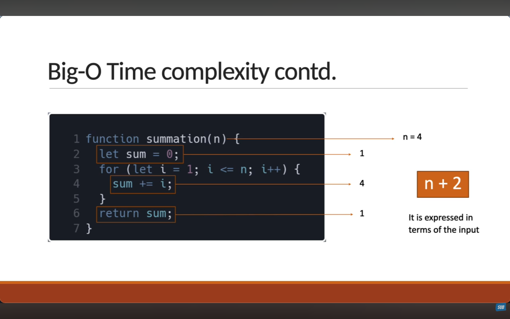
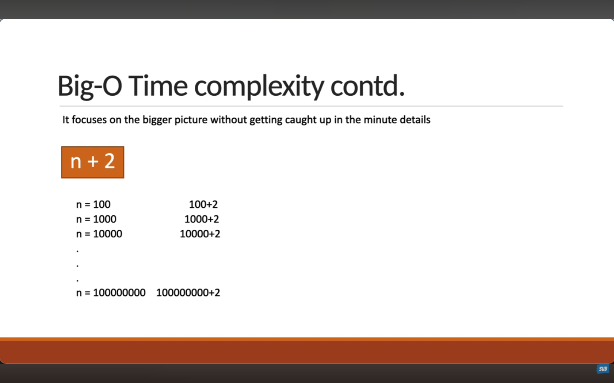
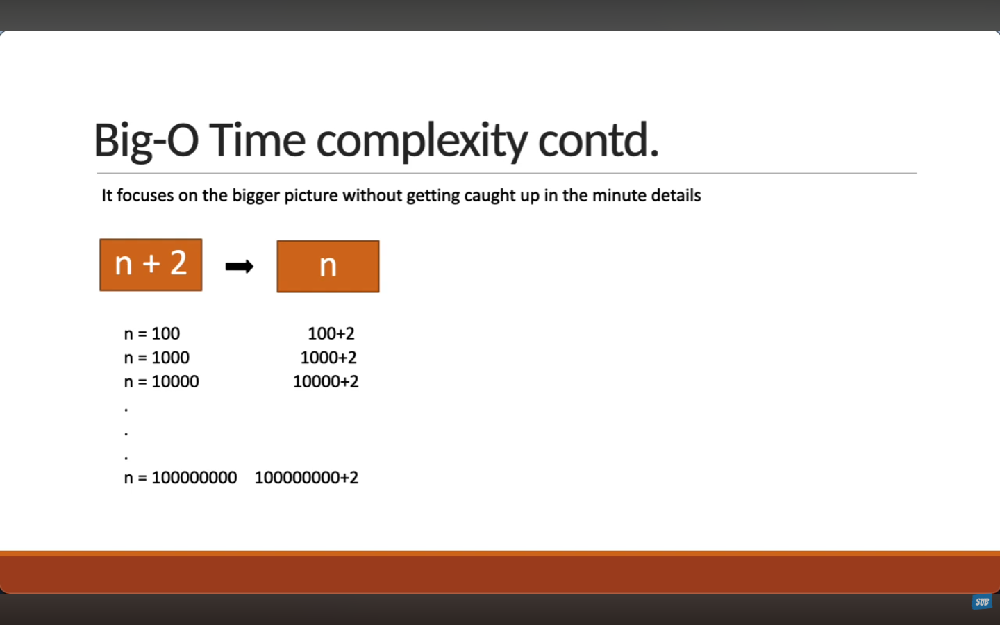

# ⏱️ Big-O Time Complexity (DSA – JavaScript)

## 📌 What Is Big-O Time Complexity?

**Big-O Time Complexity** measures how the **running time of an algorithm grows** with input size `n`.

> Focuses on the **worst-case scenario** to understand efficiency.
> 
### Characteristics
#### 1. It is expresed in terms of the input
## 🧪 JavaScript Examples

```js
let n = 4;
function summation() {
  let sum = 0; //runs once
  for (let i = 1; i <= n; i++) {
    sum += i; //runs 4(n) times
  }
  return sum; //runs once
}
//output = 1+2+3+4=10
```

>ounts the number of times a statement executes based on the **input size**



#### 2. It focuses on the bigger pictures without getting cought up in the minute 


>As the programs grows the *n+2* becomes insignificant
>*n+2 is droped since *n* can contribute the most to the total value 

I'm not cought up ni small steps that does not affect the program