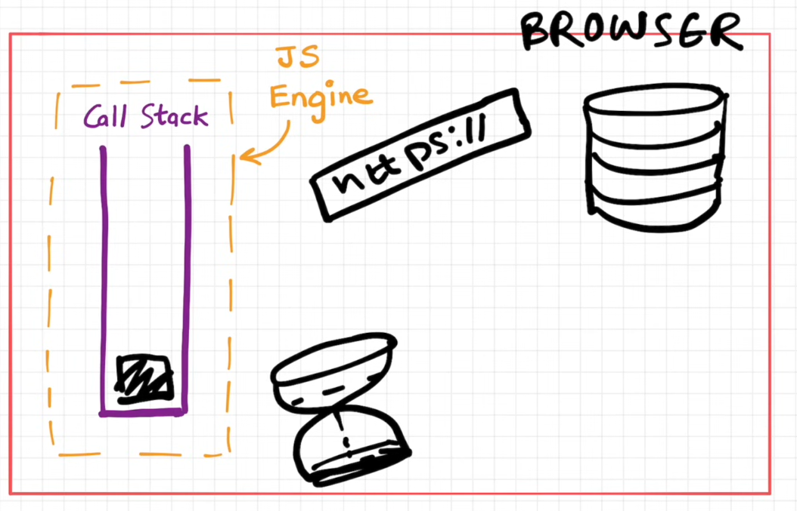

# JavaScript Event Loop – Deep Dive

**Goal:** Understand the JS event loop, microtasks, macrotasks, async/await, and task ordering.

---

## 1. Event Loop Basics

**Concepts:**

- JS is single-threaded
- Call stack
- Web APIs / Browser APIs / Node APIs
- Task queues: macrotasks vs microtasks

**Diagram:**  

**Notes / Key Points:**
Eventy loop **continously monitors** the **call stack** and the call **back queue**

> It takes a function waiting to be executed from the call back queue and pushes it to the call stack

## -Js engime lies inside the browser

## Web APIs

It includes:

1. Set time out
2. Dom APIs
3. Fetch()
4. Local storage
5. Console
6. location
   ETC...
   > They all live in the browser
   > We get all these staff through global object
   > The browser gives JS engine all these facilities through _Window_ keyword

## Microtask queue

> It is similr to allbak queue but has a higher priority
> Functions found in this queue will be exwcuted firt an ones found in call back stack will be executed later
> All call back functions that comes through promises and mutation observer goes to the microtask queue

> starvation is whereby the call back queue functions takes long to be executed coz of many functions in the microtask queue

### Macrotasks (Timers) – `setTimeout`, `setInterval`

[Watch the video](https://www.youtube.com/watch?v=8zKuNo4ay8E)

### 1. setTimeout registration

When you run:

```js
console.log("start");

setTimeout(() => {
  console.log("timeout");
}, 0);

console.log("end");
```

Here’s what happens:

1. JS registers the callback with the browser/Node timer system.

The timer starts counting down (even 0ms isn’t instant — the minimum delay is ~4ms in browsers for nested timers).

After the timer expires, the callback is put into the macrotask queue (just like a click event).

Execution in the event loop

The event loop works like this:

Check if call stack is empty.

Pick the next task from the macrotask queue (timers, events, etc.).

Push the callback to the call stack.

Execute it synchronously.

So even setTimeout(fn, 0) never runs immediately — it always waits until the current stack finishes.

3. With microtasks (Promises)

If you mix setTimeout with promises:

console.log('start');

setTimeout(() => console.log('timeout'), 0);

Promise.resolve().then(() => console.log('microtask'));

console.log('end');

Execution order:

start → synchronous

end → synchronous

microtask → from promise

timeout → from macrotask queue (setTimeout)

✅ Key point: microtasks always run before the next macrotask, even if a macrotask is “ready” (like a timer).

| Feature               | Event Listener            | `setTimeout`              |
| --------------------- | ------------------------- | ------------------------- |
| Added to queue        | Macrotask queue           | Macrotask queue           |
| Trigger               | User action / event       | Timer expires             |
| When executed         | Stack empty               | Stack empty               |
| Priority vs microtask | Microtasks after callback | Microtasks after callback |
| Typical use           | Reacting to user input    | Delay / schedule tasks    |

### Event listeners

#### 1. Setup

When you attach an event listener:

```js
button.addEventListener("click", () => {
  console.log("Button clicked!");
});
```

Nothing happens immediately.

JS just registers this function as a listener.

The function is now in memory, waiting for the event (like “click”).

#### 2. Event occurs

User clicks the button.

The browser detects the event (click) in its own event-handling system.

The event is put into the macrotask queue (aka task queue) — because DOM events are macrotasks.

#### 3. Call stack check

The event loop constantly does this:

Check if the call stack is empty.

If the call stack is empty, it takes the next task from the task queue (macrotask queue) and pushes it to the call stack.

At this moment, your click callback is still not running if the stack isn’t empty.

#### 4. Event listener executes

Once the stack is empty, the event listener callback is pushed onto the call stack.

JS executes the function synchronously, just like any other function.

After it finishes, the call stack is empty again.

#### 5. Microtasks vs Macrotasks

Event listeners for DOM events are treated as macrotasks.

If inside the listener you have a promise:

button.addEventListener('click', () => {
console.log('start click');
Promise.resolve().then(() => console.log('microtask'));
console.log('end click');
});

The execution order:

start click → synchronous

end click → synchronous

microtask → after listener finishes (microtasks run before next macrotask)

#### 6. Visualizing the flow

[Call Stack] empty
↓
[Event Loop] checks macrotask queue
↓
[Click Event Task] pushed to call stack
↓
JS executes listener function
↓
Listener done → call stack empty
↓
Event loop continues
