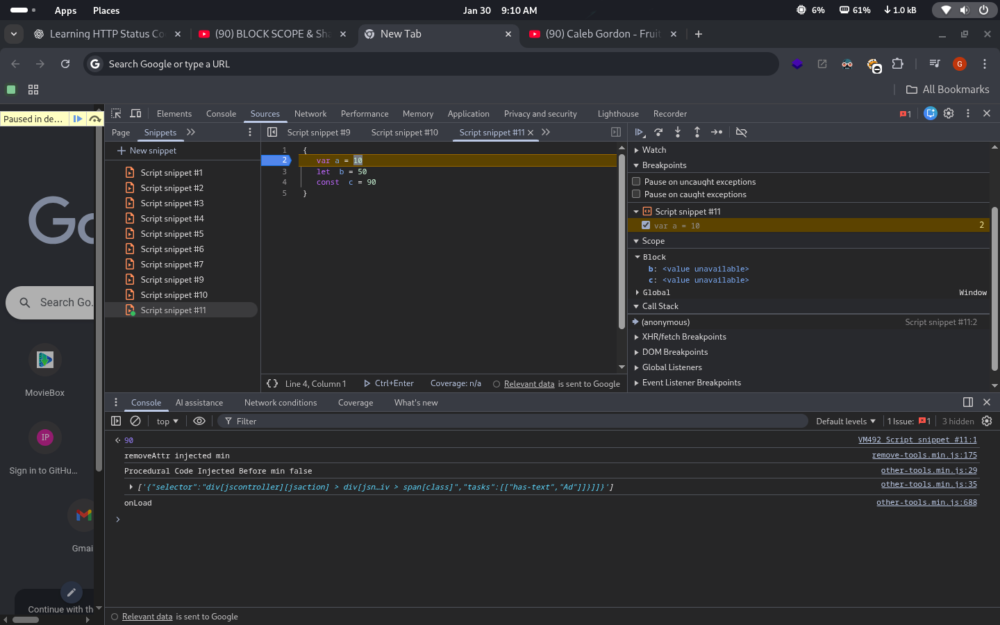

# JavaScript Block Scope & Shadowing

## 🎯 Goal

Understand **how block-scoped variables work** and how **shadowing affects identifier resolution** in JavaScript.

---

## 1️⃣ Block Scope

> A block in js is anything inside curly braces **{}**
> -It is also known as compound statement
> -it is used to combine js statements into one group
> _We group multiple statements in js so that we can use them where js expects one statement_ eg: in IF statements

> **Block scope means all variables and functions that can be accesed whithin a block**

> Variables declared with `let` or `const` are **block-scoped**.  
> They exist only inside the `{}` they are declared in.

```js
if (true) {
  let blockVar = "inside block";
  const blockConst = 10;
  console.log(blockVar); // "inside block"
}
console.log(blockVar); // ❌ ReferenceError
console.log(blockConst); // ❌ ReferenceError
```



```js
{
  var a = 10;
  let b = 50;
  const c = 90;
}
```

_Var a_ is hoisted in the **global scope** while _let b_ and _const c_ are hoisted in a **separate space**

> Variables declared with `let` or `const` are **block-scoped**.  
> They exist only inside the `{}` they are declared in.

## Shadowing

> Shadowing happens when an **inner block declares a variable with the same name as an outer scope variable**.
> The inner variable hides the outer one inside its block.

```js
let value = 100;

{
  let value = 50; // shadows outer 'value'
  console.log(value); // 50
}

console.log(value); // 100  (outer value remains)
```

### Shadowing with var vs let

```js
let a = 1;

function test() {
  var a = 2; // shadows outer 'a' inside function
  console.log(a); // 2
}

test();
console.log(a); //
```

```js
let b = 10;

{
  let b = 20; // shadows outer 'b' inside block
  console.log(b); // 20
}
console.log(b); // 10
```

```js
var y = 5;

{
  var y = 10; // no block scope, overwrites outer y
  console.log(y); // 10
}

console.log(y); // 10 (outer is changed!)
```

#### Key Points

- let and const → block-scoped

- var → function-scoped, ignores block scope

- Inner declarations shadow outer variables

- Shadowed variables do not affect outer scope

- Useful for loops, conditionals, and temporary variables
- let = safe shadowing, block-confined

- var = can unintentionally overwrite variables outside block

**Mental Model**

- Block scope → variables “live” only inside { }

- Shadowing → inner variables temporarily hide outer ones

- Always ask:

“Which variable will JS pick in this scope?”
