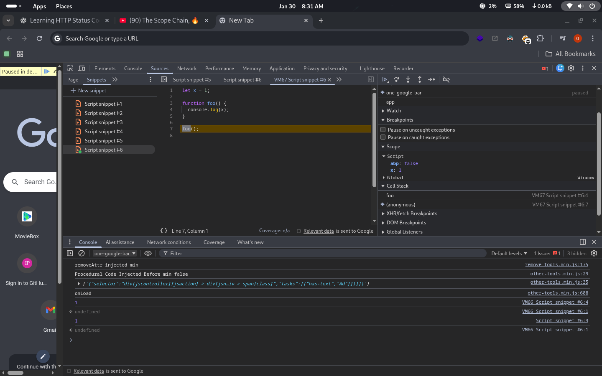
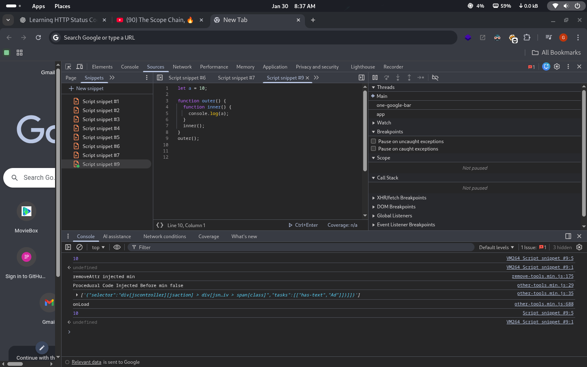
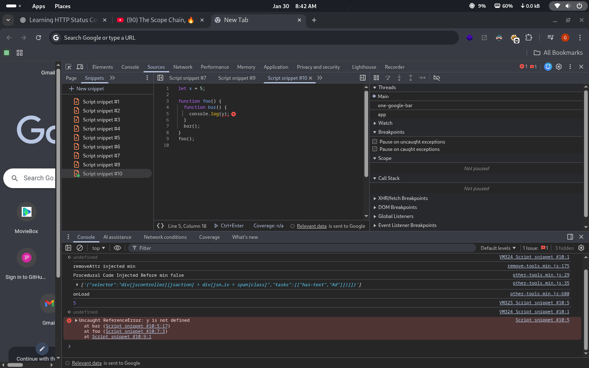

# JavaScript Scope & Lexical Environment 

## 🎯 Goal

Understand **how JavaScript resolves identifiers** using scope, lexical environments, and the scope chain.

---

## 1️⃣ What is Scope?

> Scope determines **where variables are accessible** in JavaScript.

JavaScript has **lexical (static) scoping**.

> A** lexical environment** is the local memory along with the lexical enviroment of its parent
> -Scope is directly dependant on the lexical env
> -Whenever an execution context is created, A lexical environment is also created

---

## 2️⃣ Types of Scope

### 🌍 Global Scope

- Variables declared outside any function or block
- Accessible everywhere

```js
let globalVar = "I am global";

function test() {
  console.log(globalVar);
}
```

-Js willl look for globalVar in local memory since it is not there it will go to the lexical environment of its parent which is the **global execution context**

> The proces is called **scope chain** is the chain of parent references
> -The scope chain defines wheather a variable is in lexical environment or not

> lexical environment = **local memory** + **lexical env of parent**


-Javascript will look in its local memory, if a is not foung it will look in the global execution context



```js
let a = 10;

function outer() {
  function inner() {
    console.log(a);
  }
  inner();
}
outer();
```

inner() can access a because of lexical scope.



```js
let x = 5;

function foo() {
  function bar() {
    console.log(y);
  }
  bar();
}
foo();
```

-When JS looks for a variable:

1. Current scope

2. Parent scope

3. Global scope

-If not found → **ReferenceError**
